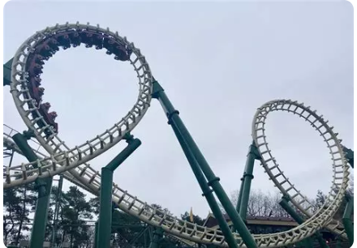

# Projet : Le contrôleur d'Accès du Grant Huit 

##  Mission  

> Vous êtes un data scientist au sein d'un parc d'attraction .

> L'objectif est de mettre en place un terminal de sécurité pour les accès . 

- Opérateurs de comparaison : Afin de savoir si les clients respectent les conditions.

-  Structures conditionnelles : if , elif et else. 

Voici les  données de départ :

```python
  
age_str = input("Quel est votre âge ? ")
age = int(age_str)