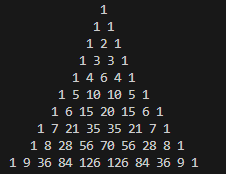

# Projet : Le Triangle de Pascal 

##  Mission  

> Vous êtes un data scientist au sein d'un service chargé des maths .

> L'objectif est de mettre en place un triangle via pascal  . 

> for : range , enumerate , zip


Voici les  données de départ :

```python
  nbre_lignes = int(input("Merci d'entrer le nombre de lignes"))
 
  triangle =  [] # liste vide


